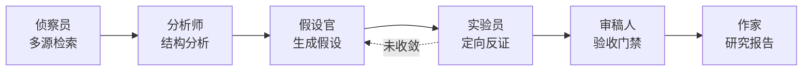

# chem-research-agents

> 多角色协作的化学自主科研闭环 —— 从文献侦察到研究报告，每一步都有独立验收。

把「看以前的研究 → 形成自己的假设 → 反复试验验证 → 根据结果调整」这条链路，做成**可执行、可复核、可复现、可积累**的工作流。

零第三方依赖，仅用 Python 标准库；只调用免费公开的学术数据库。

---

## 为什么不是又一个文献综述工具

大多数文献分析工具跑到「统计出低共现的概念组合」就结束了，直接把它当作研究空白输出。

**这是错的。**

我们用 MOF CO2 capture 主题实测过：统计层面识别出 3 条「语料内零共现」的组合，看起来是教科书级的空白 —— 定向检索一查，本领域早就有 7 篇、4 篇交叉研究。

> **语料内零共现 ≠ 真空白。** 多半只是检索覆盖不足造成的采样偏差。

所以本项目强制加入 **定向反证**：主动构造精准查询去打权威库，用真实结果去证伪每一条候选。

### 还有一个更隐蔽的坑：比较基准必须一致

反证检索必须带**领域锚点**（如 `MOF`）。若不带锚点，查 `catalysis selectivity` 会拉回全学科的通用催化文献，把本该成立的空白全部误判为「已被研究」。

实测数据：不加锚点时 **8/8 条候选被错误地推翻**；加上锚点后同一批候选的交叉数从 13 降至 7，判定才回归合理。

---

## 工作流



六个角色各司其职，通过明确的输入输出契约通信。每个阶段完成即落盘，因此支持**断点续跑**。

| 角色 | 职责 | 产出 |
|---|---|---|
| 侦察员 Scout | 多源并行检索 + 跨源去重 + 语料治理 | 统一文献清单 |
| 分析师 Analyst | 概念抽取、年代趋势、共现网络、空白探测 | 候选缺口 + 多维评分 |
| 假设官 Hypothesizer | 把缺口转成可检验假设卡 | 含否证条件的假设 |
| 实验员 Experimenter | 逐条执行定向反证 | 确认 / 存疑 / 推翻 |
| 审稿人 Reviewer | 33 项检查 + 9 阻断 + 证据门禁 | 验收裁决 |
| 作家 Writer | 组装研究报告 | 带置信度标签的综述 |

---

## 审稿门禁

核心原则：**审稿人不接受上游的自我声明，一律自己重算。**

| 上游声称 | 审稿人动作 |
|---|---|
| 语料 103 篇 | 自己数 |
| MOF 出现 78 次 | 从原始语料重算概念频次 |
| 该锚点文献存在 | 到语料里比对 ID 与标题 |
| 这是研究空白 | 复核反证留痕与交叉密度 |

**9 项阻断项**（任一未通过则禁止交付）：

| 编号 | 检查 | 判据 |
|---|---|---|
| B01 | 语料规模足以支撑空白探测 | 去重后 ≥ 30 篇 |
| B02 | 可用数据源数量 | ≥ 2 个 |
| B03 | 元数据完整性 | 年份 ≥ 70% 且摘要 ≥ 30% |
| B04 | 主题关键词覆盖度 | ≥ 50% |
| B05 | 假设具备否证条件 | 全部 |
| B06 | 有效结论附证据锚点 | 全部 |
| B07 | 关键统计量可独立复算 | 逐项一致 |
| B08 | 无异常未来年份 | 0 条 |
| B09 | 存在可交付的有效结论 | 确认 + 存疑 > 0 |

外加 24 项常规检查与 4 项**确定性证据门禁**（纯计算、不联网、可重复，无条件作为交付前最后闸门）。

### 门禁不是摆设

开发过程中它抓出了两个会**静默流入最终报告**的真实缺陷：

1. **命题库静默丢失**：ID 解析只查顶层字段，取不到就退化为 `P000`，导致 4 条假设写进同一文件互相覆盖成 1 条。流程照常结束、报告照常产出，**只有条数一致性校验能发现**。
2. **复核口径不一致**：审稿人复算共现时只匹配规范名 `MOF`，漏掉 `MOFs` / `metal-organic framework` 等变体，报出「声明 48、复算 33」的假告警。

> 教训：**口径不一致的复核，本身就是缺陷来源。** 正确做法是共享术语定义、只让计算路径独立。

---

## 快速开始

```bash
git clone https://github.com/<owner>/chem-research-agents.git
cd chem-research-agents/scripts

python run.py probe                                   # 数据源健康体检
python run.py list                                    # 列出四个研究方向
python run.py --topic "MOF CO2 capture" --domain materials --depth standard

python selftest.py                                    # 54 项离线单元测试（不联网）
```

> 需要 Python 3.10+。无需安装任何依赖，无需 API Key。

### 主要参数

| 参数 | 说明 |
|---|---|
| `--topic` | 研究主题，中英文皆可。越具体越好 |
| `--domain` | `materials` / `synthesis` / `computational` / `analytical` |
| `--depth` | `quick`(≈35篇/1轮) / `standard`(≈100篇/3轮) / `deep`(≈200篇/5轮) |
| `--workspace` | 工作区根目录，每个主题自动建独立子目录 |
| `--reset [阶段...]` | 重置指定阶段（连同产物清理）后重跑 |

### 断点续跑与人工干预

```bash
# 中断后重复同一命令即可继续，已完成阶段自动跳过
python run.py --topic "..."

# 强制重做某几个阶段
python run.py --topic "..." --reset review write
```

运行期间可在工作区写 `control.json` 实现安全停机：

```json
{"action": "pause"}
```

---

## 知识库

每次研究产出独立工作区（多任务并行隔离）：

```
workspace/<主题slug>__<方向>/
├── state.json      断点状态
├── Problems/       研究问题清单
├── Corpus/         语料快照
├── Propos/         命题库（假设 + 验证状态）
├── Methods/        方法库（可复用判据）
├── Verified/       通过门禁的可信结论
├── Rejected/       已推翻结论（防止重复踩坑）
└── Reports/        最终研究报告
```

`Rejected/` 是方法论沉淀的关键 —— **下次做同类研究，被推翻过的假设不会再走一遍弯路**。

---

## 四个研究方向

| key | 方向 | 特点 |
|---|---|---|
| `materials` | 材料化学 | MOF、沸石、钙钛矿、能源与催化材料，公开库覆盖最好 |
| `synthesis` | 有机合成方法学 | 反应条件、底物范围、催化循环 |
| `computational` | 计算化学与分子模拟 | DFT、分子动力学、机器学习势函数，预印本占比高 |
| `analytical` | 分析化学与传感 | 检测方法、传感材料、灵敏度与检出限 |

采用**策略模式**：四个方向共享同一套引擎，各自提供领域知识（检索词骨架、概念词典、假设句式、空白组合维度）。

新增方向只需在 `domains.py` 里继承 `ChemistryDomain` 并填领域知识，引擎无需改动。

---

## 数据源

| 数据源 | 协议 | 说明 |
|---|---|---|
| [OpenAlex](https://openalex.org) | REST，免费 | 开放学术图谱，提供引用网络与概念标签 |
| [Crossref](https://crossref.org) | REST，免费 | DOI 官方注册库，元数据权威 |
| [Europe PMC](https://europepmc.org) | REST，免费 | 摘要 + 开放获取全文，**PubMed 的完整镜像** |
| [arXiv](https://arxiv.org) | Atom XML，免费 | 预印本，前沿指标 |

### 关于降级链

实测发现部分网络环境下 `pubchem.ncbi.nlm.nih.gov`、`eutils.ncbi.nlm.nih.gov`（PubMed 直连）不可达，Semantic Scholar 无 key 时持续 429 限流，ChemRxiv 返回 403。

架构因此内置降级策略：

- PubMed → **Europe PMC**（数据同源，无缝替代）
- 任一数据源失败只记录台账、不影响整体
- 对 429 / 503 做指数退避重试

---

## 实测数据

| 选题 | 方向 | 语料 | 结论 |
|---|---|---|---|
| MOF CO2 capture | 材料化学 | 103 篇 | 确认 0 / 存疑 3 / 推翻 2 |
| MOF sensor pesticide detection | 分析化学 | 106 篇 | 确认 0 / 存疑 1 / 推翻 0 |

离线单元测试 **54 项全通过**，覆盖去重指纹、降级链、反证判定、知识库、断点状态、门禁裁决。

### 一个诚实的结论

成熟领域往往探测不到「确认」级空白。MOF CO2 capture 在 103 篇语料下所有候选要么被推翻、要么降级为「存疑」。

**这不是失败** —— 说明该领域主流交叉已被充分研究，真正有价值的切入点需要更细的颗粒度或更大的语料。我们没有为了产出漂亮结论而放宽判定标准。

---

## 已知局限

1. **概念粒度偏粗**：词典以领域通用术语为主，识别不了「潮湿烟气下 MOF 的缺陷工程」这类细颗粒度命题，需人工研判补足
2. **只覆盖摘要文本**：付费墙文献若缺摘要，仅能匹配标题，贡献有限
3. **中文文献未接入**：当前四个数据源以英文文献为主
4. **报告为 Markdown**：尚未接入 PDF 排版输出

---

## 项目结构

```
chem-research-agents/
├── SKILL.md              技能说明书（供 AI Agent 加载）
├── scripts/
│   ├── sources.py        数据源适配器（抽象基类 + 4 实现 + 降级链 + 双指纹去重）
│   ├── domains.py        四个方向的领域策略 + 225 条同义词归并表
│   ├── analyze.py        概念抽取 / 趋势 / 共现网络 / 空白探测与评分
│   ├── verify.py         反证实验（假设生成 / 领域锚点 / 定向检索判定）
│   ├── reviewer.py       审稿门禁（33 项检查 + 9 阻断 + 证据门禁）
│   ├── kb.py             结构化知识库 + 断点状态管理
│   ├── writer.py         研究报告组装
│   ├── orchestrator.py   主控：六角色编排 + 断点续跑 + 门禁卡点
│   ├── run.py            命令行入口
│   ├── selftest.py       离线单元测试（54 项）
│   └── test_reviewer.py  对已有产物单独跑审稿
├── references/
│   └── methodology.md    方法论详解：算法定义、评分公式、调参指南
└── workspace/            各主题的独立工作区（运行产物，不入库）
```

---

## 设计文档

- [`SKILL.md`](SKILL.md) —— 技能说明书，含角色契约、门禁体系、知识库结构
- [`references/methodology.md`](references/methodology.md) —— 方法论详解，含空白评分公式、阈值校准依据、调参速查表

---

## License

[MIT](LICENSE)
